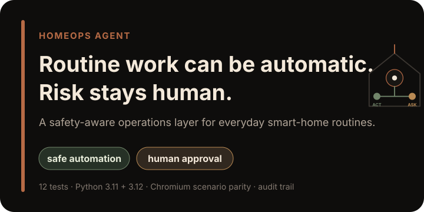
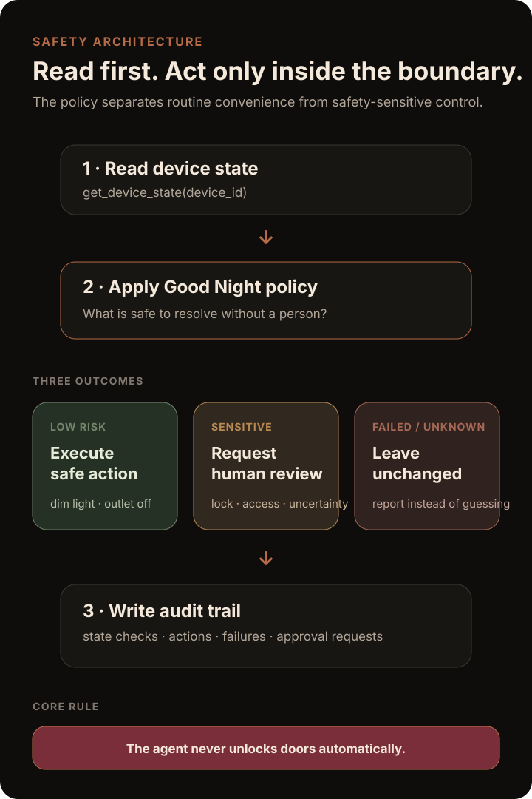
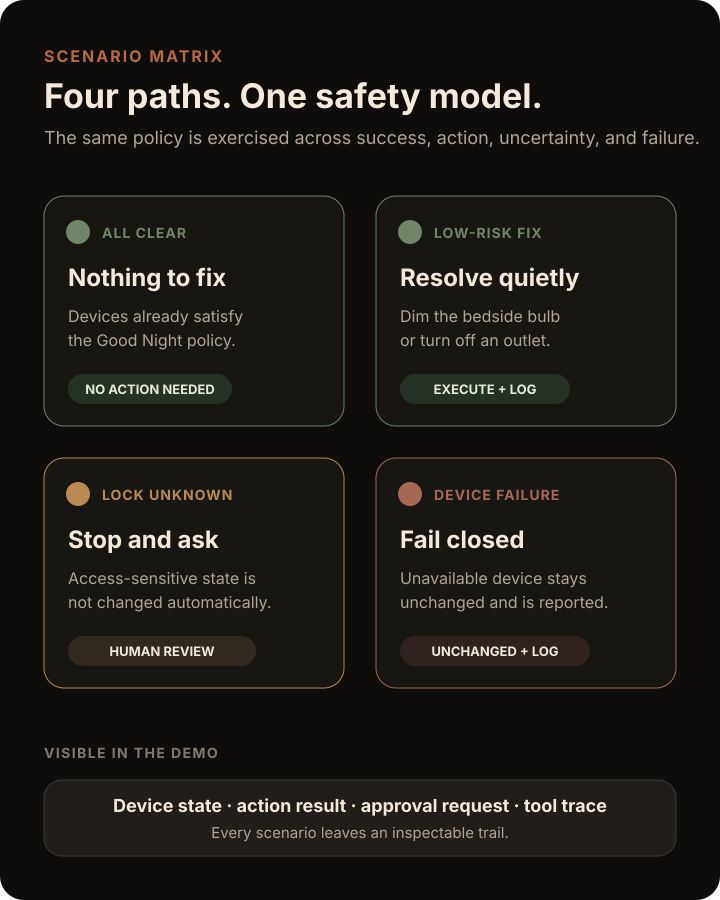

<p align="center">
  
</p>

<p align="center">
  <strong>A safety-aware agent for household operations.</strong><br />
  HomeOps checks device state, handles low-risk routine work, and stops for human review when access, locks, uncertainty, or failed integrations raise the risk.
</p>

<p align="center">
  <a href="https://github.com/AjaneeI/homeops-agent/actions/workflows/tests.yml"></a>
  <a href="https://github.com/AjaneeI/homeops-agent/actions/workflows/web-smoke.yml"></a>
</p>

<p align="center">
  <a href="#problem">Problem</a> ·
  <a href="#what-i-built">What I built</a> ·
  <a href="#safety-model">Safety model</a> ·
  <a href="#four-deterministic-scenarios">Scenarios</a> ·
  <a href="#evidence">Evidence</a> ·
  <a href="#demo">Demo</a> ·
  <a href="#run-locally">Run locally</a>
</p>

<p align="center">
  <a href="https://ajaneeigharo.com/work/homeops-agent"><strong>View the live case study →</strong></a>
</p>

---

## Problem

Smart homes often become a collection of separate apps, routines, and voice commands. The harder problem is not controlling devices. It is deciding **what an agent should be allowed to do automatically and where it should stop and ask a person**.

HomeOps Agent explores that boundary through one focused workflow: **Good Night Check**.

The system reads current device state, completes explicitly allowed low-risk actions, escalates safety-sensitive or uncertain conditions, and records every decision in an inspectable audit trail.

## What I built

- a deterministic Good Night Check policy in Python
- simulated smart-home devices for repeatable testing and demos
- explicit tool contracts for state reads, safe actions, approval requests, and audit logging
- allowlisted low-risk actions rather than open-ended device control
- a human approval boundary for door-lock and access-sensitive conditions
- failure handling that leaves unreachable devices unchanged
- a visible web dashboard with device state, actions, approvals, audit history, and tool trace
- a Strands adapter using `Agent` and `@tool` interfaces
- automated Python regression coverage on 3.11 and 3.12
- Playwright/Chromium scenario-parity coverage for the web demo

The public implementation is intentionally **bounded and reproducible**. It demonstrates the control model without claiming a production smart-home deployment.

## Current evidence

| Signal | Verified state |
| --- | --- |
| Python tests | **12 passing** |
| Python matrix | **3.11 and 3.12** |
| Main CI | Latest Python workflow on `main` passes |
| Browser verification | Chromium scenario-parity workflow completed successfully |
| Device layer | Deterministic simulated devices |
| Safety boundary | Lock/access changes are approval-gated |
| Failure behavior | Failed device actions leave state unchanged and are logged |
| Agent framework | Strands agent + tool adapter implemented |
| Live physical integration | Not part of the current public implementation |

## Safety model

<p align="center">
  
</p>

The core separation is deliberate:

- **Low-risk routine work** can execute automatically when the requested action is explicitly allowlisted.
- **Safety-sensitive or uncertain state** produces a human approval request instead of an autonomous change.
- **Failed or unavailable devices** remain unchanged. The agent reports the failure rather than guessing.
- **Every path** writes to the audit trail and tool trace.

The strongest invariant is simple: **HomeOps never unlocks a door automatically.**

The deterministic policy lives in [`src/homeops_agent/agent.py`](src/homeops_agent/agent.py), and the tool/device layer lives in [`src/homeops_agent/tools.py`](src/homeops_agent/tools.py).

## Four deterministic scenarios

<p align="center">
  
</p>

### All clear

The home already satisfies the Good Night policy. The agent records what it checked and avoids unnecessary actions.

### Low-risk fix

Eligible routine devices can be corrected automatically, including actions such as dimming the bedside bulb or turning off the outlet.

### Lock unknown

An uncertain front-door state does not become permission to act. HomeOps records an approval request and leaves the lock unchanged.

### Device failure

If a device is unreachable, the safe-action call fails explicitly. The agent records the failure and preserves the existing device state.

## Tool contracts

```text
get_device_state(device_id) -> status
execute_safe_action(device_id, action) -> result
request_human_approval(action, reason) -> approval_status
write_audit_log(event) -> log_entry
```

These contracts are intentionally small. The Strands adapter exposes the same boundary rather than giving the model broad device access.

## Evidence

### Automated Python proof

The latest verified `main` workflow runs the suite on Python 3.11 and 3.12:

```text
12 passed
```

Coverage includes:

- low-risk actions execute and produce tool/audit events
- uncertain lock state requires human approval
- failed device actions do not mutate failed device state
- cross-scenario policy invariants

### Browser scenario parity

The Playwright workflow runs the web demo in Chromium and checks that the visible scenario behavior stays aligned with the deterministic policy. The latest completed scenario-parity run passed.

This matters because the browser is not only decorative. Its visible state, actions, approvals, and failure semantics are checked against the intended workflow behavior.

## Demo

Start the static dashboard:

```bash
python3 -m http.server 4173 -d web
```

Then open:

```text
http://localhost:4173
```

The dashboard surfaces:

- current device state
- actions taken
- approvals required
- audit history
- tool-call trace

## Strands path

The deterministic policy and the agent-framework adapter are kept separate so the safety logic stays inspectable.

Build the Strands agent object:

```bash
PYTHONPATH=src python -m homeops_agent.cli --build-strands-agent
```

Run the deterministic scenario:

```bash
PYTHONPATH=src python -m homeops_agent.cli --scenario fix-needed
```

A live Strands entrypoint also exists for environments with model-provider credentials configured:

```bash
PYTHONPATH=src python -m homeops_agent.cli --live-strands-run --scenario fix-needed
```

The public repository does **not** use that path as evidence of live-model quality.

## Simulated vs. real integrations

The current public demo uses simulated devices on purpose. That makes safety and failure behavior reproducible and keeps the portfolio claim precise.

A sensible first live integration would be a **low-risk light or outlet read/action path**. Door locks should remain read-only or approval-gated.

The proposed AWS/AgentCore deployment shape is documented in [`docs/agentcore-deployment-plan.md`](docs/agentcore-deployment-plan.md).

## Run locally

Install the project and test dependencies:

```bash
python -m pip install -e ".[dev]"
```

Run the Python suite:

```bash
python -m pytest -q
```

Run a deterministic failure scenario:

```bash
PYTHONPATH=src python -m homeops_agent.cli --scenario device-failure
```

For the browser smoke test:

```bash
npm install
npx playwright install chromium
npm run test:web
```

## Repository map

```text
.
├── .github/workflows/
│   ├── tests.yml            # Python 3.11 / 3.12 regression suite
│   └── web-smoke.yml        # Chromium scenario-parity check
├── docs/
│   ├── assets/              # portfolio-facing visual system
│   ├── agentcore-deployment-plan.md
│   ├── architecture.md
│   └── judging-map.md
├── src/homeops_agent/
│   ├── agent.py             # deterministic Good Night policy
│   ├── tools.py             # simulated devices + tool boundary
│   ├── strands_adapter.py   # Strands Agent / @tool integration
│   └── cli.py
├── tests/
│   ├── test_agent.py
│   ├── test_policy_invariants.py
│   └── web-smoke.spec.js
├── web/                     # interactive static dashboard
├── BUILD_LOG.md
├── SECURITY.md
└── README.md
```

## Engineering decisions

**Keep deterministic policy testable outside the model.** Safety rules can be exercised directly instead of relying on prompt behavior.

**Treat uncertainty as a stop condition.** Unknown lock state does not become an inferred permission.

**Fail closed.** An unavailable device is reported and left unchanged.

**Audit everything meaningful.** State checks, attempted actions, successful actions, failures, and approval requests remain inspectable.

**Expand permissions incrementally.** A real low-risk integration should come before broader device control.

## Limitations

- The public device layer is simulated.
- The project does not claim production deployment or physical-device validation.
- Python tests validate deterministic policy and simulated tool behavior, not live model quality.
- The Strands live path requires external model-provider credentials and is not the public evidence anchor.
- The browser demo demonstrates the same bounded scenarios rather than open-ended smart-home control.

## Supporting docs

- [`BUILD_LOG.md`](BUILD_LOG.md) — implemented behavior, deterministic evidence, and scope boundaries
- [`docs/judging-map.md`](docs/judging-map.md) — original hackathon framing and scoring map
- [`docs/agentcore-deployment-plan.md`](docs/agentcore-deployment-plan.md) — proposed AWS/AgentCore path
- [`SECURITY.md`](SECURITY.md) — security guidance for the public repository

## Portfolio signal

This project demonstrates:

- agent/tool design around explicit permissions
- human-in-the-loop controls for safety-sensitive actions
- deterministic policy testing around an AI-agent interface
- failure-path engineering instead of happy-path-only demos
- auditability and observable tool behavior
- browser verification of user-visible scenario semantics
- a migration path from simulation toward bounded real integrations
