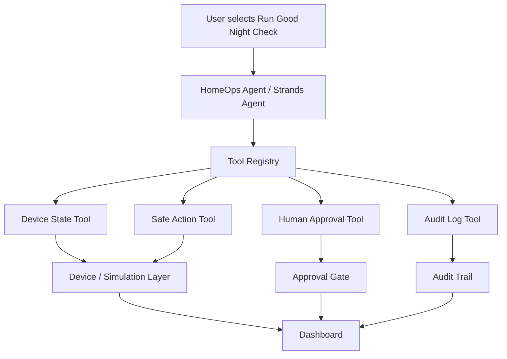

# Architecture

## Flow

1. The user starts Good Night Check.
2. The agent reads device state through tool calls.
3. Low-risk actions run automatically.
4. Security-sensitive or uncertain actions are paused for human review.
5. The dashboard displays state, actions, approvals, and audit history.
